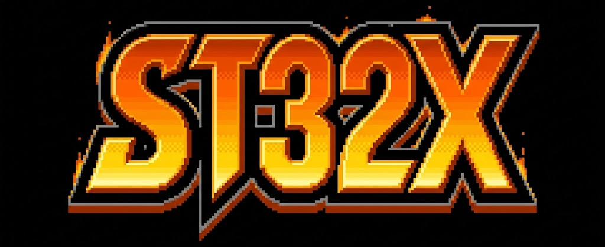

<div align="center">



**A 32-bit Fantasy Console built in C with SDL2**

[](https://creativecommons.org/licenses/by-nc/4.0/)
[](https://en.wikipedia.org/wiki/C_(programming_language))
[](https://www.microsoft.com/windows)
[](https://www.libsdl.org/)
[]()


</div>


---

## What is ST32X?

**ST32X** is a fantasy console — an imaginary piece of hardware that never existed, fully emulated in software. Inspired by the golden age of 16-bit/32-bit consoles and designed for 2D pixelart games, it combines the nostalgia of classic game hardware with a clean, modern **32-bit linear architecture**.

You write programs in **ST32X Assembly**, assemble them into a binary ROM, and the emulator runs them — complete with graphics, sound, and gamepad input.

It is a complete system built from scratch:

- A **custom CPU** with a 32-bit address space and 16 general-purpose registers
- A **GPU** with 6 display layers, 256 sprites, hardware scrolling and collision detection
- An **APU** with 16 wavetable audio channels at 44100 Hz
- A **custom assembler** that turns `.asm` source files into runnable binaries (Roms)
- **SDL2** for window rendering, audio output, and gamepad support

---

## Feature Highlights

### CPU
- 32-bit linear address space — no bank switching, no memory segmentation
- 16 general-purpose 32-bit registers (`R0`–`R15`, with `R15` as SP)
- 50+ instructions: arithmetic, logic, shifts, memory, jumps, stack, I/O
- Big-Endian byte order
- Hardware alignment correction for 16-bit and 32-bit accesses
- Full flag set: Zero, Negative, Carry, Overflow

### GPU

| Feature 		| Details 															|
|---------------|-------------------------------------------------------------------|
| Layers 		| BG2 → BG1 → BG0 → Sprites → FG → HUD (back to front) 				|
| Tile size 	| 16×16 pixels, 8bpp (256 colors per tile) 							|
| Tilemap 		| 32×32 tiles per layer 											|
| Sprites 		| 256 hardware sprites with scaling, H/V flip, 4 priority levels 	|
| Palettes 		| 32 palettes × 256 colors, RGB555 format 							|
| Scrolling 	| Per-layer pixel-perfect hardware scrolling 						|
| Collision 	| Hardware sprite-sprite AABB detection 							|
| Resolutions 	| 320×224 (4:3) or 400×224 (16:9) 									|
| Raycasting 	| Placeholder for fake-3D mode (work in progress) 					|

### APU

| Feature 		| Details 															|
|---------------|-------------------------------------------------------------------|
| Channels 		| 16 independent wavetable channels 								|
| Sample formats| PCM 8-bit unsigned or 16-bit signed 								|
| Sample rate 	| 44100 Hz stereo output 											|
| Per channel 	| Volume (0–255), Stereo pan (0–255), Pitch, Loop point 			|
| Mixing 		| All active channels mixed in software 							|

### Controllers
- Up to 4 simultaneous USB gamepads
- 8 buttons: **A B X Y L R SELECT START**
- D-PAD 4 directions
- Xbox controller compatible (SDL2 GameController API + raw joystick fallback)
- `BUTTONS_PREV` register for single-press edge detection in assembly

### Assembler
- Two-pass assembler with full label support
- 32-bit absolute addressing throughout
- `.org` directive for ROM layout control
- Inline comments, clean error reporting

---

## Architecture Overview

```
┌─────────────────────────────────────────────────────┐
│                    ST32X System                     │
│                                                     │
│  ┌──────────┐     ┌──────────┐     ┌──────────────┐ │
│  │  CPU     │───▶   Memory    ◀──       ROM      │ │
│  │ 32-bit   │     │  Bus     │     └──────────────┘ │
│  │ 16 regs  │     │          │                      │
│  └────┬─────┘     └────┬─────┘                      │
│       │                │                            │
│  ┌────▼────────────────▼──────────────────────┐     │
│  │              MMIO (0x00100000+)            │     │
│  │  ┌──────────┐ ┌──────────┐ ┌───────────┐   │     │
│  │  │   GPU    │ │   APU    │ │Controllers│   │     │
│  │  │ 6 layers │ │ 16 ch.   │ │ 4 pads    │   │     │
│  │  │ 256 spr. │ │ 44100Hz  │ │ 8 btn.    │   │     │
│  │  └──────────┘ └──────────┘ └───────────┘   │     │
│  └────────────────────────────────────────────┘     │
└─────────────────────────────────────────────────────┘

Memory Map:
  0x00000000 – 0x0007FFFF   RAM       512 KB
  0x00080000 – 0x000FFFFF   VRAM      512 KB
  0x00100000 – 0x0010FFFF   MMIO       64 KB
  0x00200000 – 0x03FFFFFF   ROM       ~62 MB
```

---

## Getting Started

### Prerequisites

- GCC or MSYS2/MinGW on Windows
- SDL2 development libraries

**Windows (MSYS2):**
```bash
pacman -S mingw-w64-x86_64-gcc mingw-w64-x86_64-SDL2
```

**Linux (Ubuntu/Debian):**
```bash
sudo apt install gcc libsdl2-dev
```

---

### Build

```bash
# Clone the repository
git clone https://github.com/Lespleiades/ST32X-32-bits-fantasy-console.git
cd ST32X-32-bits-fantasy-console

# Compile the emulator
gcc -o bin\st32x_console src\main.c src\cpu.c src\gpu.c src\apu.c src\controller.c -lSDL2 -lm -O2 -Wall

# Compile the assembler (standalone)
gcc src\assembler.c -o bin\st32x_asm -lws2_32
```
Or simply use build/build.bat

---

### Running the Demo

```bash
# Step 1 — Assemble your program
bin\st32x_asm test\input.asm bin\output.bin

# Step 2 — Run it from bin folder
cd bin
st32x_console.exe
```

The console automatically loads `output.bin` from the current directory and starts execution at `0x00200000`.

---

### Your First Program

```asm
; hello.asm — Display a red background and a moving sprite
.org 0x00200000

main:
    LI  R15, 0xFFFC         ; Initialize stack pointer
    LIH R15, 0x0007         ; SP = 0x0007FFFC

    ; Enable GPU
    LI R0, 0x0001
    STRI 0x00100200, R0

    ; Set red color in palette 0, index 1
    LI R0, 0xF800
    STRI 0x00100302, R0

    ; Enable BG0, tilemap @ VRAM+0x1000
    LI R0, 0x0001 : STRI 0x00100218, R0
    LI R0, 0x1000 : STRI 0x00100214, R0

    ; Fill tilemap with red tiles (MSET value 1 → tile index 257)
    LI R1, 1
    LI R2, 0x1000 : LIH R2, 0x0008
    LI R3, 2048
    MSET

    ; Create the tile pixels in VRAM
    LI R1, 1
    LI R2, 0x0100 : LIH R2, 0x0009
    LI R3, 256
    MSET

loop:
    VSYNC
    JMP loop

    HALT
```
---

## Project Structure

```
st32x/
  │
src/
  ├── main.c          — Entry point, SDL2 init, main loop, ROM loader
  ├── cpu.c / cpu.h   — 32-bit CPU core, memory bus, instruction decoder
  ├── gpu.c / gpu.h   — GPU: layers, sprites, palettes, collision, renderer
  ├── apu.c / apu.h   — APU: 16-channel wavetable audio engine
  ├── controller.c    — Gamepad input (SDL2 GameController + joystick fallback)
  ├── controller.h    —
  └── assembler.c     — Two-pass assembler (standalone executable)
  │
test/
  └── input.asm       — Demo program source
  │
bin/
  ├── build.bat 
  └── output.bin      — Compiled ROM (generated by assembler)
  │
doc/
  └── ST32X_DOCUMENTATION.md  — Technical reference
```

---

## Technical Reference

The documentation is available in [`ST32X_DOCUMENTATION-EN.md`](doc/ST32X_DOCUMENTATION-EN.md).

It covers:
- ISA (50+ instructions with opcodes and encoding)
- MMIO memory map with register addresses
- GPU layer system, palette format, sprite table layout
- APU channel configuration and sample formats
- Controller MMIO registers and button masks
- Assembler syntax, directives, and encoding rules
- MSET tilemap mechanics (the N×257 rule)
- All known hardware quirks and limitations

---

## Development Roadmap & TODO List

This document outlines the priority tasks for the ST32X project based on the current state of the APU, CPU, GPU, and Assembler sources.

### 🔴 High Priority: System & Core
- [ ] **Interrupt Management:** - Add IRQ/NMI support to the CPU logic.
- [ ] Link the GPU VBlank signal to an interrupt trigger for timing synchronization.
- [ ] **Timing Accuracy:** Update the instruction cycle counting (currently defaults to 1 cycle for all opcodes).

### 🟡 Medium Priority: Graphics & Audio
- [ ] **GPU - Collision System:** Implement the logic for Sprite-to-Tile collisions.
- [ ] **Sprite Rotation/Scaling:** Add support for affine transformations (rotation and zoom) for individual sprites.
- [ ] **Affine Backgrounds:** Finalize the "Mode 7" style raycasting engine using the existing SIN/COS LUTs.
- [ ] **APU - Audio Quality:** - Implement **linear interpolation** for pitch-shifting to eliminate aliasing noise.
- [ ] Add basic **ADSR envelopes** (Attack, Decay, Sustain, Release) for volume control.

### 🔵 Low Priority: Tools & Optimization
- [ ] **Assembler (ASM) Enhancements:** Add `.db` / `.dw` directives for raw data insertion.
- [ ] Add `.incbin` directive to include external assets (graphics/sound) directly into the binary.
- [ ] **GPU - Rendering Optimization:** Transition from pixel-by-pixel rendering to a more efficient **scanline-based** renderer.
- [ ] **Debug Tools:** Develop a basic real-time disassembler to monitor execution flow during emulation.

---

## Contributing

Contributions are welcome! Here are some ways to get involved:

- **Code correction / modifications** in ST32X files
- **Opcodes completion** if necessary
- **Write demo programs** in ST32X Assembly and submit them
- **Implement missing GPU features** (DMA, sprite-tile collision)
- **Port to Linux/macOS** and report any build issues
- **Write tests** for the CPU instruction set
- **Improve the assembler** (macro support, include directives, better errors)
- **Fix bugs** — see the open issues

### How to contribute

1. Fork the repository
2. Create a branch: `git checkout -b feature/my-feature`
3. Commit your changes: `git commit -m "Add: my feature"`
4. Push: `git push origin feature/my-feature`
5. Open a Pull Request

Please read the technical documentation before contributing to understand the hardware architecture.

---

## License

This project is licensed under the **Creative Commons** — see the [`LICENSE.md`](LICENSE.md) file for details.

---

<div align="center">

*Built with curiosity, C, and too much coffee.*

**⭐ If you find this project interesting, consider giving it a star!**

</div>
