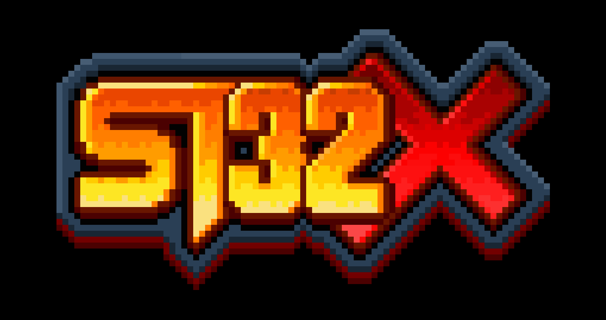

<div align="center">



**A 32-bit Fantasy Console built in C with SDL2**

[](https://www.gnu.org/licenses/gpl-3.0)
[](https://en.wikipedia.org/wiki/C_(programming_language))
[](https://www.microsoft.com/windows)
[](https://www.libsdl.org/)
[]()


</div>


---

## What is ST32X?

**ST32X** is a fantasy console — an imaginary piece of hardware that never existed, fully emulated in software. Inspired by the golden age of 16-bit/32-bit consoles and designed for 2D pixelart games, it combines the nostalgia of classic game hardware with a clean, modern **32-bit linear architecture**.

You write programs in **ST32X Assembly**, assemble them into a binary ROM, and the emulator runs them — complete with graphics, sound, and gamepad input.

It is a complete system built from scratch:

- A **custom CPU** with a 32-bit address space and 16 general-purpose registers
- A **GPU** with 6 display layers, 256 sprites, hardware scrolling and collision detection
- An **APU** with 16 wavetable audio channels at 44100 Hz
- A **custom assembler** that turns `.asm` source files into runnable binaries (Roms)
- **SDL2** for window rendering, audio output, and gamepad support

---

## ST32X vs. 32-Bit Era Consoles: Technical Comparison

The **ST32X** is a unique entry in the fantasy console landscape. While commercial machines of the mid-90s pushed for raw 3D power, the ST32X focuses on a **streamlined architecture and direct register manipulation**, making it feel more like a "Neo-Geo on steroids" than a PlayStation.

## Technical Comparison Table

| Feature | ST32X (Fantasy Console) | Sony PlayStation (1994) | Sega Saturn (1994) |
| :--- | :--- | :--- | :--- |
| **CPU Architecture** | **Custom 32-bit RISC** | MIPS R3000A | Dual Hitachi SH-2 |
| **Graphics Engine** | **Tile/Sprite Based** (4 BG layers) | Geometry Transformation Engine | Dual VDP (Quads/Sprites) |
| **3D Capabilities** | **Affine/Raycasting Only** | High (Hardware Polygons) | Moderate (Distorted Quads) |
| **Color Depth** | **RGB565** (16-bit High Color) | 15-bit to 24-bit | 15-bit to 24-bit |
| **Memory Map** | **Linear Addressing** (No Segments) | Coprocessor based | Complex (Bus switching) |
| **Storage Media** | Cartridge (binary ROM)| CD-ROM | CD-ROM |

---

## Key Differentiators

### Programming Philosophy: Assembly vs. SDKs
While most 32-bit consoles relied on complex C libraries to manage polygons, the **ST32X** is designed for **pure Assembly programming**. Its RISC instruction set and Memory-Mapped I/O (MMIO) registers are accessed directly, offering total hardware control similar to a Game Boy Advance but with 32-bit precision.

### Graphics: The "Super 2D" Approach
The ST32X excels in **rich 2D performance** rather than transforming triangles:
*   **Multi-Layering:** Supports 4 background layers (BG0-BG3) with configurable priorities.
*   **Sprite Management:** Uses a simplified OAM (Object Attribute Memory) where each sprite is defined by coordinates and a tile ID.
*   **Affine Transformations:** Includes built-in Trigonometric Tables (SIN/COS) for "Mode 7" style distortion and raycasting effects.

### Simplified Memory Management
A major advantage of the ST32X over historical hardware is its **linear memory map**:
*   **VRAM** begins at `0x00080000`.
*   **Palette** begins at `0x00100500`.
*   **I/O Registers** are logically grouped for easy access.

There is no complex memory banking or hardware cache management, making development highly predictable for solo developers.

## Summary
The **ST32X** is technically less powerful than a PlayStation for complex 3D models, but it is **significantly more optimized for high-resolution 2D games** (RGB565). it captures the essence of 32-bit hardware without the administrative complexity of commercial systems from 1994.

---

## Emulation Philosophy: ST32X vs. Classic Emulators

The **ST32X** is not a traditional emulator designed to mimic a physical past; it is a **Virtual Hardware Specification** designed for the future of hobbyist development.

### Logic-Level Virtualization vs. Hardware Reproduction

Traditional emulators (HLE/LLE) focus on reproducing the quirks and limitations of physical silicon. The ST32X focuses on **Architectural Purity**.

| Feature | Classic Emulators (PS1/Saturn) | ST32X Virtual Machine |
| :--- | :--- | :--- |
| **Primary Goal** | Historical Accuracy / Preservation | Developer Experience / Performance |
| **Memory Map** | Fragmented (Bank switching/Segments) | **Linear & Unified** (0x00000000 - 0xFFFFFFFF) |
| **I/O Handling** | Complex Bus Arbitration | **Direct MMIO Registers** |
| **Code Execution** | Binary Translation / Interpretation | **Native 32-bit RISC Execution** |
| **Graphics** | Re-interpretation (OpenGL/Vulkan) | **Byte-Direct Framebuffer/Tilemap** |

---

### Key Architectural Advantages

#### Linear Memory Addressing
Unlike 90s hardware that required complex memory banking to bypass 16-bit limits, the ST32X provides a **flat 32-bit memory space**. 
*   **VRAM Access:** Directly accessible at `0x00080000`.
*   **Palette Control:** Fast writes starting at `0x00100500`.
This eliminates the "bottleneck" logic found in classic emulators, allowing for higher performance and cleaner Assembly code.

#### MMIO (Memory-Mapped I/O) Precision
The ST32X emulator acts as a **Logic Gate Array**. By writing to specific memory addresses, the developer triggers hardware events (like GPU state changes or VSync) without the overhead of an Operating System or high-level API.

#### RISC Instruction Set Efficiency
The CPU emulation follows a strict **Reduced Instruction Set Computer (RISC)** philosophy. Every instruction is designed to be:
*   **Predictable:** No hidden "illegal opcodes" or cycle-skipping bugs.
*   **Transparent:** The state of registers `R0-R15` is always visible and consistent.

---

## Feature Highlights

### CPU
- 32-bit linear address space — no bank switching, no memory segmentation
- 16 general-purpose 32-bit registers (`R0`–`R15`, with `R15` as SP)
- 50+ instructions: arithmetic, logic, shifts, memory, jumps, stack, I/O
- Big-Endian byte order
- Hardware alignment correction for 16-bit and 32-bit accesses
- Full flag set: Zero, Negative, Carry, Overflow

### GPU

| Feature 		| Details 															|
|---------------|-------------------------------------------------------------------|
| VRAM Size | 512 KB |
| Layers 		| BG2 → BG1 → BG0 → Sprites → FG → HUD (back to front) 				|
| Tile size 	| 16×16 pixels, 8bpp (256 colors per tile) 							|
| Tilemap 		| 32×32 tiles per layer 											|
| Sprites 		| 256 hardware sprites with scaling, H/V flip, 4 priority levels 	|
| Color Depth | 8bpp (Indexed) 256 colors per tile/sprite |
| Palettes 		| 32 palettes × 256 colors, RGB565 format 							|
| Colors on Screen | 8,192 colors |
| Scrolling 	| Per-layer pixel-perfect hardware scrolling 						|
| Collision 	| Hardware sprite-sprite AABB detection 							|
| Resolutions 	| 320×224 (4:3) or 400×224 (16:9) 									|
| Raycasting 	| Placeholder for fake-3D mode (work in progress) 					|

### APU

| Feature 		| Details 															|
|---------------|-------------------------------------------------------------------|
| Channels 		| 16 independent wavetable channels 								|
| Sample formats| PCM 8-bit unsigned or 16-bit signed 								|
| Sample rate 	| 44100 Hz stereo output 											|
| Per channel 	| Volume (0–255), Stereo pan (0–255), Pitch, Loop point 			|
| Mixing 		| All active channels mixed in software 							|

### Controllers
- Up to 4 simultaneous USB gamepads
- 8 buttons: **A B X Y L R SELECT START**
- D-PAD 4 directions
- Xbox controller compatible (SDL2 GameController API + raw joystick fallback)
- `BUTTONS_PREV` register for single-press edge detection in assembly

### Assembler
- Two-pass assembler with full label support
- 32-bit absolute addressing throughout
- `.org` directive for ROM layout control
- Inline comments, clean error reporting

---

## Architecture Overview

```
┌─────────────────────────────────────────────────────┐
│                    ST32X System                     │
│                                                     │
│  ┌──────────┐     ┌──────────┐     ┌──────────────┐ │
│  │  CPU     │───▶   Memory    ◀──       ROM      │ │
│  │ 32-bit   │     │  Bus     │     └──────────────┘ │
│  │ 16 regs  │     │          │                      │
│  └────┬─────┘     └────┬─────┘                      │
│       │                │                            │
│  ┌────▼────────────────▼──────────────────────┐     │
│  │              MMIO (0x00100000+)            │     │
│  │  ┌──────────┐ ┌──────────┐ ┌───────────┐   │     │
│  │  │   GPU    │ │   APU    │ │Controllers│   │     │
│  │  │ 6 layers │ │ 16 ch.   │ │ 4 pads    │   │     │
│  │  │ 256 spr. │ │ 44100Hz  │ │ 8 btn.    │   │     │
│  │  └──────────┘ └──────────┘ └───────────┘   │     │
│  └────────────────────────────────────────────┘     │
└─────────────────────────────────────────────────────┘

Memory Map:
  0x00000000 – 0x0007FFFF   RAM       512 KB
  0x00080000 – 0x000FFFFF   VRAM      512 KB
  0x00100000 – 0x0010FFFF   MMIO       64 KB
  0x00200000 – 0x03FFFFFF   ROM       ~62 MB
```

---

## Getting Started

### Prerequisites

- GCC or MSYS2/MinGW on Windows
- SDL2 development libraries

**Windows (MSYS2):**

Download MSYS2 installer from:

```bash
https://www.msys2.org/
```

Open MSYS2 MSYS CMD and install SDL2 libraries:
 
```bash
pacman -S mingw-w64-x86_64-gcc mingw-w64-x86_64-SDL2
```

---

### Build

```bash
# Clone the repository
git clone https://github.com/Lespleiades/ST32X-32-bits-fantasy-console.git
cd ST32X-32-bits-fantasy-console

# Compile the emulator
gcc -o bin\st32x_console src\main.c src\cpu.c src\gpu.c src\apu.c src\controller.c -lSDL2 -lm -O2 -Wall

# Compile the assembler (standalone)
gcc src\assembler.c -o bin\st32x_asm -lws2_32
```
Or simply use build/build.bat

---

### Running the Demo

```bash
# Step 1 — Assemble your program
bin\st32x_asm test\input.asm bin\output.bin

# Step 2 — Run it from bin folder
cd bin
st32x_console.exe
```

The console automatically loads `output.bin` from the current directory and starts execution at `0x00200000`.

---

### Your First Program

```asm
; hello.asm — Display a red background and a moving sprite
.org 0x00200000

main:
    ; --- STACK INITIALIZATION ---
    LI  R15, 0xFFFC
    LIH R15, 0x0007         ; SP = 0x0007FFFC

    ; --- INSTALL NMI DUMMY HANDLER ---
    ; Write address of nmi_dummy to RAM 0x00000010 (NMI vector)
    ; Bits 31:16 = 0x0020 (ROM upper part)
    LI R0, 0x0020
    STRI 0x00000010, R0
    ; Bits 15:0 = lower part of nmi_dummy label address
    ; We use a small trick: load the address into R0 using a CALL
    CALL get_nmi_addr
    JMP after_nmi_init

get_nmi_addr:
    ; Load low 16 bits of nmi_dummy into R0.
    ; The assembler resolves the label and truncates to 16 bits.
    ; The high 16 bits (0x0020) were already written by the STRI above.
    ; NOTE: do NOT pop here — the return address is still on the stack.
    LI R0, nmi_dummy        ; low 16 bits of nmi_dummy address
    STRI 0x00000012, R0
    RET

after_nmi_init:
    ; --- PALETTE CONFIGURATION ---
    ; Palette base address = 0x00100500
    LI R0, 0xF800           ; Red color
    STRI 0x00100502, R0     ; Palette Index 1
    LI R0, 0x001F           ; Blue color
    STRI 0x00100504, R0     ; Palette Index 2

    ; --- VRAM TILE DATA CREATION ---
    ; Tile 257 (Background): Filled with color index 1 (Red)
    ; MSET with value 1 writes 0x01 bytes -> GPU reads 0x0101 (Index 257)
    LI R1, 1
    LI R2, 0x0100
    LIH R2, 0x0009          ; RAM 0x00090100 (VRAM offset 0x10100)
    LI R3, 256              ; 16x16 pixels
    MSET

    ; Tile 514 (Sprite): Filled with color index 2 (Blue)
    ; MSET with value 2 writes 0x02 bytes -> GPU reads 0x0202 (Index 514)
    LI R1, 2
    LI R2, 0x0200
    LIH R2, 0x000A          ; RAM 0x000A0200 (VRAM offset 0x20200)
    LI R3, 256
    MSET

    ; --- BACKGROUND CONFIGURATION (BG0) ---
    LI R0, 0x1000
    STRI 0x00100214, R0     ; Set BG0 Tilemap Address to VRAM + 0x1000
    
    ; Fill Tilemap with Tile ID 257 (Red background)
    LI R1, 1                ; MSET writes 0x01,0x01 -> ID 257
    LI R2, 0x1000
    LIH R2, 0x0008          ; RAM 0x00081000
    LI R3, 2048             ; Fill 1024 tiles (32x32 screen area)
    MSET

    LI R0, 1
    STRI 0x00100218, R0     ; Enable BG0 layer

    ; --- SPRITE INITIAL SETUP ---
    LI R0, 150              ; Initial X position
    STRI 0x00104500, R0
    LI R0, 110              ; Initial Y position
    STRI 0x00104502, R0
    LI R0, 514              ; Use Tile ID 514 (Blue pixels)
    STRI 0x00104504, R0
    LI R0, 0x0004           ; Sprite Flags: Enabled bit set
    STRI 0x00104508, R0

    ; --- GPU GLOBAL ENABLE ---
    LI R0, 1
    STRI 0x00100200, R0     ; Turn on the GPU

loop:
    VSYNC                   ; Wait for Vertical Sync (NMI will fire at VBlank)

    ; --- INPUT HANDLING ---
    LDRI R1, 0x00100112     ; Read Controller 0 D-PAD state
    LDRI R2, 0x00104500     ; Current Sprite X
    LDRI R3, 0x00104502     ; Current Sprite Y

    ; Check UP direction
    LI R4, 1
    MOV R5, R1
    AND R5, R4
    JZ check_down
    DEC R3
check_down:
    ; Check DOWN direction
    LI R4, 2
    MOV R5, R1
    AND R5, R4
    JZ check_left
    INC R3
check_left:
    ; Check LEFT direction
    LI R4, 4
    MOV R5, R1
    AND R5, R4
    JZ check_right
    DEC R2
check_right:
    ; Check RIGHT direction
    LI R4, 8
    MOV R5, R1
    AND R5, R4
    JZ update_pos
    INC R2

update_pos:
    STRI 0x00104500, R2     ; Write updated X to OAM
    STRI 0x00104502, R3     ; Write updated Y to OAM

    JMP loop

; --- NMI DUMMY HANDLER ---
; This function is called automatically by the CPU at each VBlank.
; It must end with RTI.
nmi_dummy:
    RTI

HALT
```
---

## Project Structure

```
ST32X-32-bits-fantasy-console/
  │
  ├── bin/
  │    ├── build.bat 
  │    └── output.bin      — Compiled ROM (generated by assembler)
  │
  ├── doc/
  |    └── ST32X_DOCUMENTATION.md  — Technical reference
  |
  ├── src/
  │    ├── main.c          — Entry point, SDL2 init, main loop, ROM loader
  │    ├── cpu.c / cpu.h   — 32-bit CPU core, memory bus, instruction decoder
  │    ├── gpu.c / gpu.h   — GPU: layers, sprites, palettes, collision, renderer
  │    ├── apu.c / apu.h   — APU: 16-channel wavetable audio engine
  │    ├── controller.c    — Gamepad input (SDL2 GameController + joystick fallback)
  │    ├── controller.h    —
  │    └── assembler.c     — Two-pass assembler (standalone executable)
  │
  └── test/
       └── input.asm       — Demo program source


```

---

## Technical Reference

The documentation is available in [`ST32X_DOCUMENTATION-EN.md`](doc/ST32X_DOCUMENTATION-EN.md).

It covers:
- ISA (50+ instructions with opcodes and encoding)
- MMIO memory map with register addresses
- GPU layer system, palette format, sprite table layout
- APU channel configuration and sample formats
- Controller MMIO registers and button masks
- Assembler syntax, directives, and encoding rules
- MSET tilemap mechanics (the N×257 rule)
- All known hardware quirks and limitations

---

## Development Roadmap & TODO List

This document outlines the priority tasks for the ST32X project based on the current state of the APU, CPU, GPU, and Assembler sources.

### 🔴 High Priority: System & Core
- [ ] **GPU - Collision System:** - Implement the logic for Sprite-to-Tile collisions.
- [ ] **Alpha Blending.. - implement functions for alpha blending (SDL or Hardware approach)
- [ ] **Line-scrolling:** Implement the line-scrolling for perspectives effects.

### 🟡 Medium Priority: Graphics & Audio
- [ ] **Affine Backgrounds:** - Finalize the "Mode 7" style raycasting engine using the existing SIN/COS LUTs.
- [ ] **APU - Audio Quality:** - Implement **linear interpolation** for pitch-shifting to eliminate aliasing noise.
- [ ] Add basic **ADSR envelopes** - (Attack, Decay, Sustain, Release) for volume control.

### 🔵 Low Priority: Tools & Optimization
- [ ] **Timing Accuracy:** Update the instruction cycle counting (currently defaults to 1 cycle for all opcodes).
- [ ] **Assembler (ASM) Enhancements:** - Add `.db` / `.dw` directives for raw data insertion.
- [ ] Add `.incbin` directive to include external assets (graphics/sound) directly into the binary.
- [ ] **GPU - Rendering Optimization:** Transition from pixel-by-pixel rendering to a more efficient **scanline-based** renderer.
- [ ] **Debug Tools:** - Develop a basic real-time disassembler to monitor execution flow during emulation.

---

## What's Next?

* SDK with LUA developement pipeline
* FPGA core

## Contributing

Contributions are welcome! Here are some ways to get involved:

- **Code correction / modifications** in ST32X files
- **Opcodes completion** if necessary
- **Write demo programs** in ST32X Assembly and submit them
- **Implement missing GPU features** (DMA, sprite-tile collision)
- **Port to Linux/macOS** and report any build issues
- **Write tests** for the CPU instruction set
- **Improve the assembler** (macro support, include directives, better errors)
- **Fix bugs** — see the open issues

### How to contribute

1. Fork the repository
2. Create a branch: `git checkout -b feature/my-feature`
3. Commit your changes: `git commit -m "Add: my feature"`
4. Push: `git push origin feature/my-feature`
5. Open a Pull Request

Please read the technical documentation before contributing to understand the hardware architecture.

---

## License

This project is licensed under the **Creative Commons** GPLv3 — see the [`LICENSE.md`](LICENSE.md) file for details.

Copyright (C) 2026 - Peneaux Benjamin

---

<div align="center">

*Built with curiosity, C, and too much coffee.*

**⭐ If you find this project interesting, consider giving it a star!**


</div>
